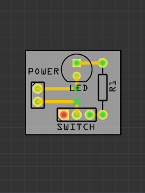

# fzz2scad

Create a 3D Model/Frontplate (OpenSCAD) of/for the PCB in a Fritzing Sketch.

The models are meant to be used to create front plates for 3D-Printed casings.
They might  also be used to create complete 3D-Models of a PCB -
depending on the parts library used.

| PCB in Friting | Model | Frontplate |
|----------------|-------|------------|
||||
|[switch_and_led.fzz](testing/fritzing/switch_and_led.fzz)|[switch_and_led_model.scad](testing/step_by_step_example/switch_and_led_model.scad)|[switch_and_led_frontplate.scad](testing/step_by_step_example/switch_and_led_frontplate.scad)|

## Note:
This tool is quite young and I did not have a chance yet to actually print
a case or a frontplate. Please share your experiences with me at the
[Issues Page](https://github.com/htho/fzz2scad/issues).

## The Problem
Fritzing does not support creating front plates for the PCBs created.
Creating a front plate for a PCB from a sketch is almost impossible because there is no
way to get the exact position of the area of a part that needs a hole in
the casing.

## How Does it Work?
fzz2scad opens Fritzings .fzz file, and extracts the coordinates,
rotation and the type of each part on the PCB to an .scad File, which
can be interpreted by OpenSCAD. 

## What do I need?
  * Fritzing
  * The Fritzing File you want to build a casing for.
  * OpenSCAD
  * The knowledge to use OpenSCAD.
  * A Library with 3D-Models of the parts on your PCB.
  (see: [scadlib](https://github.com/htho/scadlib) and [scadlib-electronic-components](https://github.com/htho/scadlib-electronic-components) )

## Quick Start
Try this:

     $ python fzz2scad.py testing/some_buttons_leds_and_a_switch.fzz

## Creating A Model (or Frontplate) from a Sketch
For a step by step introduction see the [HowTo](HOWTO.md).

# Parts Libraries
fzz2scad does not do much by it self, it simply extracts and transforms
the coordinates, from the sketch.

In Fritzing each part has a unique name. This name is translated into a
valid OpenSCAD module name. OpenSCAD ignores modules it does not know,
so fzz2scad simply dumps everything on the PCB to the file.

With the tools provided by [fzz2scad-lib](https://github.com/htho/fzz2scad-lib),
a file that contains all the necessary modules to render the model, can
be compiled. This repository provides a library of OpenSCAD models that
can be used to create the model.

# unitconverter.py
A simple script and wrapper around the functions that convert coordinates
in fzz2scad. This script is meant to be used by people who want to
create parts for the libraries. Although it shouldn't even be necessary
to use it at the moment.

#TODO

 [] Complete [HOWTO.md](HOWTO.md)

Also see the [Issues](https://github.com/htho/fzz2scad/issues).
